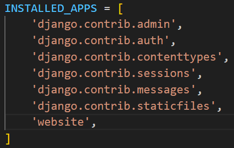

# Github
pip freeze > requirements.txt | is for creating requirements.txt file/updating.
pip install -r requirements.txt | pull all requirements from txt file.

# Creating Virtual Env
python -m venv venv
# Activate This
venv\scripts\activate.bat
# Install Django Create Project
pip install django
django-admin createproject 'project name'
python manage.py createapp 'app name'

### Add the app into Settings

# View Function For Website
def home(request):
    return render(request, 'pages/index.html')

# Urls in the app 
path('', views.home, name='') | add into the urlpatterns